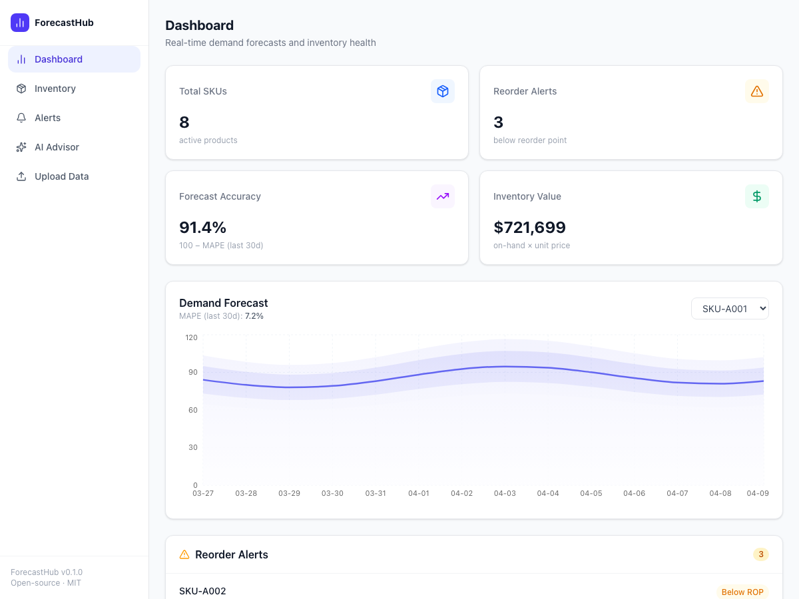

# ForecastHub

**Open-source demand forecasting dashboard that turns sales data into actionable restock decisions**

[](https://opensource.org/licenses/MIT)
[](https://www.python.org/downloads/)
[](https://nextjs.org/)
[](https://fastapi.tiangolo.com/)

**Live Demo: https://frontend-eta-sand-86.vercel.app**



---

## Why I Built This

I spent years in IT operations at a 25-location coffee chain. Every week, the ops team would open a spreadsheet, manually tally sales from the POS system, eyeball the numbers, and decide how much coffee, milk, and pastry inventory to order. When they got it wrong — and they often did — locations either ran out of product mid-morning rush or drowned in expired goods. The cost was real: lost revenue, waste, and the constant stress of flying blind.

The frustrating part was that the tools to fix this problem already existed. Libraries like StatsForecast, Darts, and Prophet can produce genuinely excellent demand forecasts — complete with confidence intervals, seasonality decomposition, and ensemble models — in under 50 lines of Python. But they output DataFrames, not dashboards. They require a data scientist to run, not a store manager. They have no UI, no alerts, no plain-English interface.

On the other side of the market, enterprise solutions like Anaplan, SAP IBP, and Blue Yonder exist — but they cost $100,000–$500,000 per year and require months of implementation consulting. For a mid-size retail chain, a coffee brand with 20 locations, or a DTC e-commerce operation, that's simply not an option. ForecastHub fills the gap: best-in-class open-source forecasting wrapped in a clean dashboard, with inventory intelligence and an AI advisor — entirely free and self-hostable.

Read the full story in [docs/WHY.md](docs/WHY.md).

---

## Features

| Feature | Description |
|---------|-------------|
| **Demand Forecasting** | 7/14/30-day forecasts using StatsForecast (AutoARIMA + SeasonalNaive ensemble) with 80% and 95% confidence bands |
| **Inventory Intelligence** | Automatic safety stock, reorder point, and EOQ calculations per SKU |
| **AI Advisor** | Ask natural-language questions powered by Groq (Llama 3.3 70B) — "which products need reordering this week?" |
| **Interactive Dashboard** | Real-time KPIs, forecast charts with historical overlay, sortable inventory tables, and reorder alerts |
| **CSV / Excel Upload** | Drag-and-drop your sales history and get forecasts instantly — no data wrangling required |
| **Persistent Storage** | Supabase (Postgres) backend — data survives restarts and supports multi-user isolation |

---

## Architecture

```
┌─────────────────────────────────────────────────────────┐
│                      ForecastHub                        │
│                                                         │
│   User                                                  │
│    │                                                    │
│    ▼                                                    │
│  ┌──────────────────────┐                               │
│  │  Next.js Dashboard   │  (Vercel / port 3000)         │
│  │  • KPI Cards         │                               │
│  │  • Forecast Chart    │                               │
│  │  • Inventory Table   │                               │
│  │  • Alert Panel       │                               │
│  │  • Ask AI            │                               │
│  │  • File Upload       │                               │
│  └──────────┬───────────┘                               │
│             │  REST API (JSON)                          │
│             ▼                                           │
│  ┌──────────────────────┐                               │
│  │  FastAPI Backend     │  (Railway / port 8000)        │
│  │  • /api/forecast     │                               │
│  │  • /api/history      │                               │
│  │  • /api/inventory    │                               │
│  │  • /api/kpis         │                               │
│  │  • /api/ask          │                               │
│  │  • /api/upload       │                               │
│  └──────────┬───────────┘                               │
│             │                                           │
│    ┌────────┼──────────────────┐                        │
│    ▼        ▼                  ▼                        │
│  ┌────────┐ ┌──────────┐ ┌──────────────┐              │
│  │Stats   │ │ Groq AI  │ │  Inventory   │              │
│  │Forecast│ │ Advisor   │ │   Logic      │              │
│  │Engine  │ │(Llama 3.3)│ │ SS / ROP/EOQ │              │
│  └────────┘ └──────────┘ └──────────────┘              │
│                  │                                      │
│                  ▼                                      │
│            ┌──────────┐                                 │
│            │ Supabase │                                 │
│            │(Postgres)│                                 │
│            └──────────┘                                 │
└─────────────────────────────────────────────────────────┘
```

**Data flow:** Sales CSV → `data_loader.py` (validate + normalize) → Supabase (persistent storage) → `forecaster.py` (StatsForecast ensemble) + `inventory_logic.py` (supply chain math) + `ai_advisor.py` (Groq with live context) → REST API → Next.js dashboard.

See [docs/ARCHITECTURE.md](docs/ARCHITECTURE.md) for the full system design.

---

## Tech Stack

**Backend**
- [FastAPI](https://fastapi.tiangolo.com/) — high-performance Python API framework
- [StatsForecast](https://github.com/Nixtla/statsforecast) (Nixtla) — AutoARIMA + SeasonalNaive ensemble forecasting
- [pandas](https://pandas.pydata.org/) — data manipulation and validation
- [Groq](https://groq.com/) — fast AI inference (Llama 3.3 70B) for the natural language advisor
- [Supabase](https://supabase.com/) — Postgres database with auth and real-time capabilities
- [Langfuse](https://langfuse.com/) — AI observability and tracing (optional)

**Frontend**
- [Next.js 16](https://nextjs.org/) — React framework with App Router
- [Recharts](https://recharts.org/) — composable charting library
- [Tailwind CSS v4](https://tailwindcss.com/) — utility-first styling
- [Lucide React](https://lucide.dev/) — icon library
- [TypeScript](https://www.typescriptlang.org/) — end-to-end type safety

---

## Quick Start

### Prerequisites
- Python 3.11+
- Node.js 18+
- (Optional) [Groq API key](https://console.groq.com) for the AI advisor
- (Optional) [Supabase project](https://supabase.com/dashboard) for persistent storage

### 1. Clone

```bash
git clone https://github.com/chipidaza23/ForecastHub.git
cd ForecastHub
```

### 2. Backend

```bash
cd backend

python -m venv .venv
source .venv/bin/activate   # Windows: .venv\Scripts\activate

pip install -r requirements.txt

cp .env.example .env
# Edit .env — add GROQ_API_KEY, SUPABASE_URL, SUPABASE_SERVICE_KEY

uvicorn main:app --reload
# API: http://localhost:8000
# Docs: http://localhost:8000/docs
```

### 3. Frontend

```bash
# In a new terminal, from the project root
cd frontend

cp .env.example .env.local
# Edit .env.local — set NEXT_PUBLIC_API_URL if backend is not on localhost:8000

npm install
npm run dev
# Dashboard: http://localhost:3000
```

The backend auto-loads 8 SKUs × 365 days of synthetic sales data on startup — no CSV needed to try it out.

---

## API Reference

| Method | Endpoint | Description |
|--------|----------|-------------|
| `POST` | `/api/upload` | Upload a CSV or Excel file of sales history |
| `GET` | `/api/forecast/{sku}` | Demand forecast for a specific SKU (default: 14-day horizon) |
| `GET` | `/api/forecast/all` | Forecasts for all SKUs |
| `GET` | `/api/history/{sku}` | Last N days of actual sales data for a SKU |
| `GET` | `/api/inventory` | Safety stock, reorder points, EOQ, and reorder alerts |
| `GET` | `/api/kpis` | Summary KPIs — total SKUs, alerts, accuracy, inventory value |
| `POST` | `/api/ask` | Natural-language question answered by Groq AI |
| `GET` | `/api/health` | Health check |

Full interactive docs available at `http://localhost:8000/docs` when the server is running.

### Input CSV Format

```
date,sku,quantity_sold,price,inventory_on_hand
2025-01-01,SKU-1000,18,49.99,320
2025-01-01,SKU-1001,32,29.99,410
```

| Column | Type | Required | Notes |
|--------|------|----------|-------|
| `date` | YYYY-MM-DD | Yes | ISO 8601 |
| `sku` | string | Yes | Product identifier |
| `quantity_sold` | integer ≥ 0 | Yes | Daily units sold |
| `price` | float | No | Used for EOQ and inventory value |
| `category` | string | No | For filtering / grouping |
| `inventory_on_hand` | integer ≥ 0 | No | Current stock level |

---

## Project Structure

```
ForecastHub/
├── backend/
│   ├── main.py              # FastAPI app and all endpoints
│   ├── forecaster.py        # StatsForecast wrapper (AutoARIMA + SeasonalNaive)
│   ├── inventory_logic.py   # Safety stock, ROP, EOQ calculations
│   ├── data_loader.py       # CSV/Excel ingestion and validation
│   ├── ai_advisor.py        # Groq AI integration with Langfuse tracing
│   ├── db.py                # Supabase client and query helpers
│   ├── auth.py              # JWT verification middleware
│   ├── requirements.txt
│   ├── .env.example
│   ├── Procfile             # Railway/Render deployment
│   ├── render.yaml          # Render deployment config
│   └── tests/               # pytest test suite
│       ├── test_api.py
│       ├── test_data_loader.py
│       ├── test_forecaster.py
│       └── test_inventory_logic.py
├── frontend/
│   ├── src/
│   │   ├── app/             # Next.js App Router pages
│   │   │   ├── page.tsx     # Dashboard
│   │   │   ├── inventory/   # Inventory management page
│   │   │   ├── alerts/      # Reorder alerts page
│   │   │   ├── ask/         # AI advisor page
│   │   │   ├── upload/      # File upload page
│   │   │   └── not-found.tsx # 404 page
│   │   ├── components/      # React components
│   │   │   ├── KPICards.tsx
│   │   │   ├── ForecastChart.tsx
│   │   │   ├── InventoryTable.tsx
│   │   │   ├── AlertPanel.tsx
│   │   │   ├── AskAI.tsx
│   │   │   ├── Sidebar.tsx
│   │   │   ├── ErrorBoundary.tsx
│   │   │   └── AuthProvider.tsx
│   │   └── lib/
│   │       ├── api.ts       # Typed API client
│   │       └── supabase.ts  # Supabase browser client
│   ├── src/__tests__/       # Jest test suite
│   ├── .env.example
│   └── package.json
├── .github/
│   └── workflows/ci.yml     # GitHub Actions CI pipeline
└── docs/
    ├── WHY.md               # Product motivation and market context
    └── ARCHITECTURE.md      # System design and technical decisions
```

---

## Built With

- [StatsForecast](https://github.com/Nixtla/statsforecast) by Nixtla — production-grade time series forecasting
- [FastAPI](https://fastapi.tiangolo.com/) — modern Python web framework
- [Next.js](https://nextjs.org/) — the React framework for the web
- [Recharts](https://recharts.org/) — composable chart components for React
- [Groq](https://groq.com/) — fast AI inference for natural-language queries
- [Supabase](https://supabase.com/) — open-source Firebase alternative (Postgres + Auth)
- [Tailwind CSS](https://tailwindcss.com/) — utility-first CSS framework

---

## Roadmap

- [x] Persistent database backend (Supabase / Postgres)
- [x] AI advisor with Groq (Llama 3.3 70B)
- [x] Drag-and-drop file upload
- [x] Historical data overlay on forecast chart
- [x] Sortable inventory table with CSV export
- [x] Error boundary and auth provider
- [x] CI/CD pipeline (GitHub Actions)
- [ ] Multi-store / multi-warehouse support
- [ ] Automated reorder notifications (email / Slack)
- [ ] ABC-XYZ inventory classification
- [ ] Supplier lead-time tracking
- [ ] TimesFM integration for zero-shot forecasting on new SKUs

---

## Contributing

Contributions are welcome. Please open an issue first to discuss what you'd like to change.

---

## License

[MIT](LICENSE) — free to use, modify, and distribute.

---

*Built by [Jaime Daza](https://github.com/chipidaza23) to solve a real problem in retail operations.*
